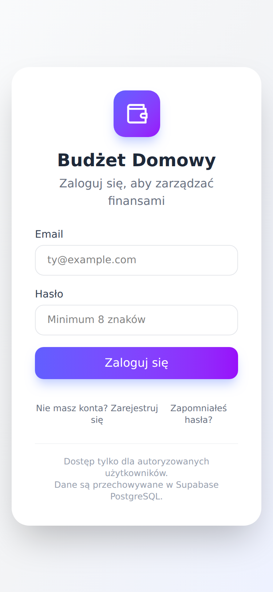
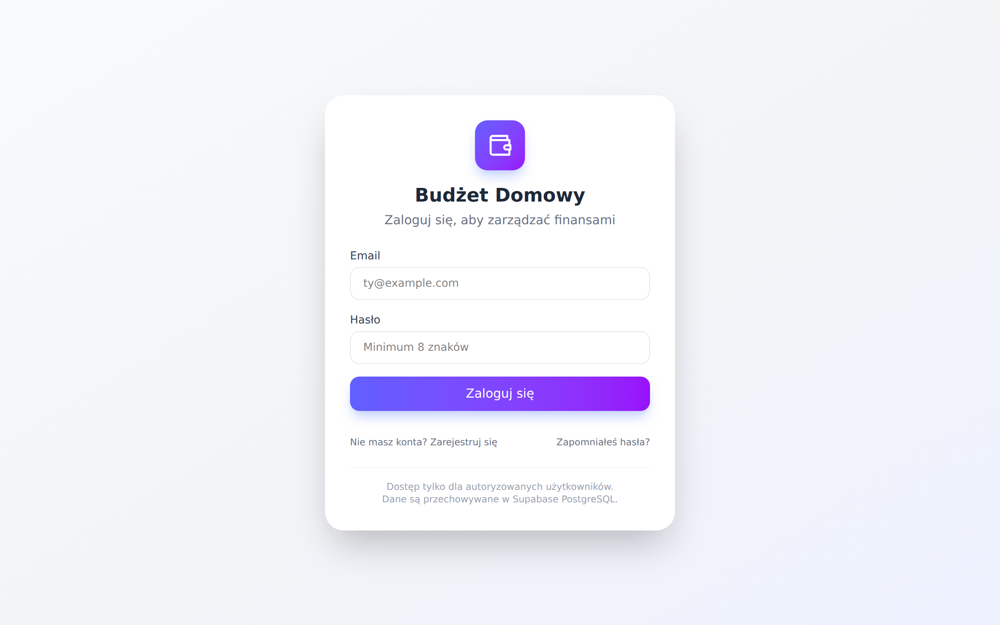

# Przegląd UX/UI — Budżet Domowy

**Data przeglądu:** 2026-07-10
**Zakres:** cały interfejs aplikacji (dashboard, formularze, modale, import CSV, budżety, podsumowanie roczne, logowanie), oceniany na podstawie pełnej analizy kodu oraz uruchomienia aplikacji lokalnie (dev server + zrzuty ekranu logowania w widoku mobile 375 px i desktop 1280 px — pozostałe ekrany są za bramką logowania Supabase, więc oceniono je z kodu).
**Punkt odniesienia dla dostępności:** WCAG 2.1 AA.

---

## 1. Podsumowanie wykonawcze

Aplikacja ma **solidne fundamenty UX**: przemyślany design mobile-first (bottom-sheety, FAB, responsywne siatki), spójną semantykę kolorów (zielony = przychód, różowy = wydatek, bursztynowy = ostrzeżenie), dobre stany puste z CTA oraz ponadprzeciętnie dopracowany wizard importu CSV (kroki, autozapis postępu, reguły rozpoznawania, kategoryzacja AI). Wizualnie jest nowocześnie i estetycznie.

Główne problemy to **dostępność** (praktycznie zerowa warstwa ARIA, brak obsługi klawiatury w kluczowych miejscach), **niespójny model offline** (część akcji zablokowana, część działa przez kolejkę — w tym przez przeoczone propsy), **zepsuta konfiguracja PWA** (manifest z placeholderami i w ogóle niepodlinkowany) oraz **rozjazd wzorców UI** (trzy różne style potwierdzeń, dwa style przycisków primary, emoji obok SVG).

### 5 najważniejszych ustaleń

| # | Ustalenie | Priorytet |
|---|-----------|-----------|
| 1 | PWA nie działa: `site.webmanifest` nie jest podlinkowany w `index.html`, a zawiera placeholdery „MyWebSite"/„MySite" | Krytyczny |
| 2 | Niespójny model offline — `TransactionItem` nie dostaje propsów `isOffline`/`addToast`, których używa; dodawanie jest zablokowane offline mimo istniejącej kolejki, a edycja/usuwanie „przypadkiem" działają | Krytyczny |
| 3 | Modale bez semantyki dialogu (`role="dialog"`, `aria-modal`), bez focus trapa i obsługi Escape | Wysoki |
| 4 | Przyciski ikonowe bez `aria-label` (nawigacja miesięcy, FAB, zamykanie modali, edycja/usuwanie) + akcje widoczne dopiero po hover | Wysoki |
| 5 | Trzy konkurujące wzorce potwierdzeń/komunikatów: `window.confirm`, `alert()` i własny dialog | Wysoki |

---

## 2. Mocne strony

- **Mobile-first z prawdziwego zdarzenia**: formularz transakcji jako bottom-sheet na mobile (`items-end sm:items-center`, `rounded-t-3xl`), FAB (`md:hidden`), responsywne siatki `grid-cols-1 md:grid-cols-3`, treść ograniczona do `max-w-4xl`.
- **Spójna semantyka kolorów** w całej aplikacji: emerald = przychód, rose = wydatek, amber = ostrzeżenie, indigo/purple = brand. Progres budżetu zmienia kolor progowo (zielony → bursztynowy ≥80% → czerwony ≥100%) i **dodatkowo** komunikuje stan tekstem („Blisko limitu", „Przekroczono") — wzorcowe, bo nie polega wyłącznie na kolorze (`components/CategoryCharts.jsx:384-388`).
- **Wizard CSV** (`components/CSVImport.jsx`) — najlepiej zaprojektowany flow w aplikacji: wskaźnik kroków, drag&drop z wyraźnym stanem przeciągania, automatyczne wykrywanie formatów banków (PKO BP, Millennium), autozapis postępu do `localStorage` z ofertą przywrócenia, edytowalny podgląd przed importem, reguły rozpoznawania z natychmiastowym zastosowaniem i licznikiem dopasowań, wyraźny ekran sukcesu.
- **Stany puste z CTA**: „Brak transakcji w tym miesiącu" + link „Dodaj pierwszą transakcję" (`src/App.jsx:1532-1548`), „Wybierz rok do porównania" z ikoną (`CompareTab.jsx:43-47`).
- **Feedback systemowy**: toasty sukces/błąd, banner offline z licznikiem operacji do synchronizacji i stanem „Synchronizowanie…" (`src/components/OfflineBanner.jsx`), spinnery ze stanem tekstowym („Zapisywanie…", „Importuję…").
- **Ochrona przed utratą danych**: ostrzeżenia przy usuwaniu kategorii/osób w użyciu z liczbą powiązanych transakcji (`src/App.jsx:562-581`), ostrzeżenie o nadpisaniu budżetu rocznego miesięcznym (`components/Budgets.jsx:91-100, 319-324`).
- **Formularze**: każde pole ma widoczny `<label>`, pola auth mają poprawne `autocomplete` (`email`, `current-password`/`new-password`) i `minLength` (`src/components/LoginPage.jsx:206-261`).
- **Porównanie lat jako prawdziwa tabela HTML** z nagłówkami (`CompareTab.jsx:99-120`) — dostępna i czytelna; wykresy mają zawsze tekstową listę szczegółów pod spodem.

---

## 3. Ustalenia

Priorytety: **Krytyczny** (blokuje funkcję lub wyklucza grupę użytkowników) · **Wysoki** (istotnie utrudnia korzystanie) · **Średni** (zauważalne tarcie) · **Niski** (dopracowanie).

### 3.1. PWA i warstwa dokumentu

| Priorytet | Problem | Lokalizacja |
|---|---|---|
| **Krytyczny** | **Manifest PWA nie jest podlinkowany** — w `index.html` brakuje `<link rel="manifest" href="/site.webmanifest">`, więc mimo przygotowanych ikon 192/512 aplikacji **nie da się zainstalować** na telefonie. | `index.html:1-22` |
| **Krytyczny** | Manifest zawiera **placeholdery z generatora**: `"name": "MyWebSite"`, `"short_name": "MySite"` — po naprawieniu linku aplikacja instalowałaby się pod tą nazwą. Brak `start_url`, `lang`, `description`; `theme_color: #ffffff` jest niezgodny z `<meta name="theme-color" content="#6366f1">`; ikony tylko `purpose: maskable` (brak wariantu `any`). | `public/site.webmanifest:2-3,18-19` |
| Średni | Zduplikowany, rozjeżdżający się `<meta name="description">` („domowych wydatków i przychodów" vs „domowego budżetu"). | `index.html:12,15` |
| Niski | Brak service workera — deklarowany „tryb offline" opiera się na cache w JS, ale sama aplikacja (HTML/JS) nie załaduje się po otwarciu bez sieci, co czyni tryb offline w praktyce działającym tylko przy utracie sieci w trakcie sesji. Warto to albo dodać (np. `vite-plugin-pwa`), albo świadomie odnotować ograniczenie. | — |

### 3.2. Model offline (spójność zachowań)

| Priorytet | Problem | Lokalizacja |
|---|---|---|
| **Krytyczny** | `TransactionItem` przyjmuje i używa propsów `isOffline` oraz `addToast` (guard + komunikat „W trybie offline nie możesz edytować/usuwać"), ale **wywołanie ich nie przekazuje** — guardy nigdy się nie uruchamiają. | definicja `src/App.jsx:391,428-450`; wywołanie bez propsów `src/App.jsx:1550-1556` |
| **Wysoki** | Sprzeczny model offline. Handlery `handleAddTransaction`/`handleEditTransaction`/`handleDeleteTransaction` mają pełną obsługę offline przez kolejkę (`addToQueue`, optymistyczne aktualizacje, toast „zsynchronizuje się po połączeniu" — `src/App.jsx:1154-1167,1190-1207,1245-1258`), ale UI: (a) chowa FAB offline (`src/App.jsx:1614`), (b) blokuje przycisk „Dodaj" toastem „możesz tylko czytać dane z cache" (`src/App.jsx:1516-1523`), (c) przez błąd z pkt. wyżej pozwala edytować/usuwać. Banner mówi „tylko odczyt" (`src/components/OfflineBanner.jsx:38`). Efekt: kod kolejki dla dodawania to martwa ścieżka, a użytkownik dostaje trzy różne odpowiedzi na to samo pytanie „co mogę robić offline?". **Rekomendacja:** wybrać jeden model (sugerowany: pełny zapis offline przez kolejkę, skoro już istnieje i jest przetestowana) i ujednolicić FAB, przycisk „Dodaj", guardy i treść bannera. | jw. |
| Średni | Dwa różne komponenty `OfflineBanner` (lokalny w `LoginPage` z komunikatem „Sprawdź sieć i spróbuj ponownie" vs globalny z „dane z cache") — inna treść i wygląd dla tego samego stanu. | `src/components/LoginPage.jsx:4-34` vs `src/components/OfflineBanner.jsx` |

### 3.3. Dostępność (WCAG 2.1 AA)

| Priorytet | Problem | Lokalizacja (przykłady) |
|---|---|---|
| **Wysoki** | **Modale nie są dialogami**: brak `role="dialog"`, `aria-modal="true"`, `aria-labelledby`, brak focus trapa (Tab wychodzi do treści pod spodem), brak zamykania klawiszem Escape, focus nie jest przenoszony do modala przy otwarciu ani przywracany po zamknięciu. Dotyczy wszystkich 4 modali + 2 dialogów potwierdzenia. Kliknięcie w przyciemnione tło też nie zamyka (brak `onClick` na overlayu) — niespójne z oczekiwaniami. | `src/App.jsx:244` (formularz), `760` (ustawienia), `959` (potwierdzenie); `components/Budgets.jsx:168,444`; `components/CSVImport.jsx:784` |
| **Wysoki** | **Przyciski ikonowe bez dostępnej nazwy.** Część ma tylko `title` (niewystarczające dla czytników i dotyku), część nie ma nic: chevrony nawigacji miesięcy (`src/App.jsx:1421-1435`), FAB „+" (`src/App.jsx:1615-1620`), zamykanie toasta (`src/contexts/ToastContext.jsx:80-88`), zamykanie modali (`src/App.jsx:250-255,770-775`), usuwanie wiersza „✕" w CSV (`components/CSVImport.jsx:1199-1204`). **Rekomendacja:** `aria-label` na każdym przycisku bez tekstu; `aria-hidden="true"` na dekoracyjnych SVG. | jw. |
| **Wysoki** | Akcje edycji/usuwania transakcji są na desktopie **niewidoczne do momentu najechania** (`sm:opacity-0 sm:group-hover:opacity-100`) i nie mają wariantu `focus-visible` — użytkownik klawiatury tabuje po niewidocznych przyciskach; szkodzi też odkrywalności. **Rekomendacja:** dodać `sm:focus-visible:opacity-100` lub zrezygnować z ukrywania. | `src/App.jsx:437,451` |
| **Wysoki** | **Toasty**: kontener bez `role="status"`/`aria-live` (czytniki ekranu nie ogłaszają komunikatów) i sztywne auto-zniknięcie po 3 s — dla komunikatów o **błędach** to za szybko (WCAG 2.2.1). Podobnie błędy w CSV Import znikają po 6 s. **Rekomendacja:** `aria-live="polite"`, błędy bez auto-dismissu lub ≥8 s + pauza na hover. | `src/contexts/ToastContext.jsx:13-15,56`; `components/CSVImport.jsx:366-370` |
| **Wysoki** | **Kontrast tekstu poniżej AA (4.5:1)** dla drobnych szarości na białym: `text-gray-300` (~1.5:1, np. znacznik autozapisu „Zapis: …"), `text-gray-400` (~2.5:1 — podkategorie, komentarze, opisy pól, stopka logowania). | `components/CSVImport.jsx:1044-1047`; `src/App.jsx:405,415`; `src/components/LoginPage.jsx:303-307` |
| Średni | `<label>` nigdzie nie jest powiązany z polem przez `htmlFor`/`id` — klik w etykietę nie fokusuje pola, a powiązanie dla technologii asystujących jest tylko domyślne/pozycyjne. Wzorzec powtarza się we wszystkich formularzach. | np. `src/App.jsx:282,291,308`; `components/Budgets.jsx:183,223`; `components/CSVImport.jsx:943` |
| Średni | **Cele dotykowe poniżej 44×44 px**: chevrony miesięcy (`p-1.5` ≈ 32 px), edycja/usuwanie transakcji (`w-8 h-8` = 32 px), edycja/usuwanie budżetów (`p-1.5` + ikona 14 px ≈ 26 px), zamykanie toasta (~22 px). Na mobile precyzyjne trafienie jest trudne. | `src/App.jsx:1422,437`; `components/Budgets.jsx:381-394` |
| Średni | Przełączniki widoku (Kołowy/Słupkowy, zakładki roczne, Wydatek/Przychód, wybór osoby) to grupy zwykłych `<button>` bez `aria-pressed`/`role="tab"` — stan „wybrany" komunikowany wyłącznie kolorem. | `components/CategoryCharts.jsx:236-255`; `src/components/YearlySummary.jsx:31-45`; `src/App.jsx:260-277` |
| Niski | Animacje (flip 3D przełącznika widoku, `animate-pulse`, `hover:scale-110` FAB, slideIn toastów) bez respektowania `prefers-reduced-motion`. | `src/App.jsx:1326-1347,1617`; `src/index.css:3-12` |
| Niski | Tooltipy wykresów Recharts dostępne tylko z myszy/dotyku; łagodzi to tekstowa lista pod wykresem — warto ją zachować przy każdej zmianie. | `components/CategoryCharts.jsx:334-396` |

### 3.4. Użyteczność i przepływy

| Priorytet | Problem | Lokalizacja |
|---|---|---|
| **Wysoki** | **Trzy wzorce potwierdzeń/komunikatów o błędach**: natywny `window.confirm` (usuwanie transakcji, budżetów, przywracanie postępu CSV), natywny `alert()` (walidacja i błędy budżetów) oraz dopracowany własny dialog (ustawienia, nadpisanie budżetu). Natywne okna wyglądają obco, nie pokazują kontekstu i na mobile bywają blokowane. **Rekomendacja:** jeden współdzielony `ConfirmDialog` (wzorzec już istnieje w `src/App.jsx:958-990`) + toasty na błędy. | `src/App.jsx:1243`; `components/Budgets.jsx:108,134,141,151`; `components/CSVImport.jsx:336` |
| **Wysoki** | **Brak nawigacji URL/historii**: widoki, miesiące i modale nie zmieniają adresu. W PWA/przeglądarce mobilnej systemowy „wstecz" **zamyka aplikację zamiast modal** — częsta przyczyna frustracji; nie da się też podlinkować konkretnego miesiąca. **Rekomendacja:** minimalnie — obsługa `history.pushState`/`popstate` dla modali; docelowo lekki routing (`?view=yearly&y=2026`). | `src/App.jsx:1003-1030` |
| Średni | Przełącznik miesięczny/roczny to **flip-ikona w miejscu logo**: pokazuje ikonę *bieżącego* widoku, a `title` opisuje *docelowy* — niejednoznaczna afordancja; jedyna droga do widoku rocznego jest ukryta za jednorazową podpowiedzią. **Rekomendacja:** jawny segmented control („Miesiąc | Rok") obok nawigacji okresu. | `src/App.jsx:1322-1356` |
| Średni | Budżety: po zapisie **brak komunikatu sukcesu** (formularz cicho się czyści), a „Edytuj" **cicho ładuje wartości do formularza na górze** bez trybu edycji, scrolla ani podświetlenia — łatwo nie zauważyć i „dodać" zamiast „zmienić". | `components/Budgets.jsx:126-131,155-165` |
| Średni | Lista transakcji: zagnieżdżony scroll `max-h-[500px]` (drugi pasek przewijania w stronie), brak wyszukiwarki/filtra/grupowania po dniu — po imporcie CSV z setkami pozycji nawigacja robi się uciążliwa. | `src/App.jsx:1531` |
| Średni | Formularz transakcji: pole **Data nie jest `required`** (można wysłać pustą datę, podczas gdy kwota i kategoria są wymagane); brak autofocusu na pierwszym polu po otwarciu modala. | `src/App.jsx:283-288` |
| Średni | Wizard CSV: wybór „Osoby" (przypisanie **wszystkich** importowanych transakcji jednej osobie) jest wciśnięty w krok mapowania kolumn bez wcześniejszej zapowiedzi; zamknięcie modala w kroku 2 porzuca pracę bez ostrzeżenia (autozapis obejmuje dopiero krok 3). | `components/CSVImport.jsx:960-973,760-763` |
| Średni | Nawigacja miesięcy tylko chevronami po jednym miesiącu — brak szybkiego skoku (wybór miesiąca z listy) i przycisku „dziś/bieżący miesiąc" po odpłynięciu o kilkanaście kliknięć. | `src/App.jsx:1419-1436` |
| Niski | Wykres słupkowy pokazuje tylko **top 8 kategorii** bez żadnej informacji o obcięciu. | `components/CategoryCharts.jsx:179-186` |
| Niski | Ekran logowania: brak „pokaż hasło"; stopka „Dane są przechowywane w Supabase PostgreSQL" to żargon techniczny bez wartości dla użytkownika; „Zapomniałeś hasła?" zakłada rodzaj męski (lepiej: „Nie pamiętasz hasła?"). | `src/components/LoginPage.jsx:280,302-308` |
| Niski | Tytuł karty przeglądarki to zawsze „Budżet Domowy" — bez informacji o widoku/miesiącu (utrudnia pracę na wielu kartach). | `index.html:16` |

### 3.5. Spójność wizualna i system designu

| Priorytet | Problem | Lokalizacja |
|---|---|---|
| Średni | **Brak warstwy design tokens / komponentów bazowych** — każdy przycisk, input i modal to ręcznie powtarzany zestaw klas Tailwind. Skutek widać w rozjazdach: przycisk primary raz jest gradientem indigo→purple (`src/App.jsx:374`), raz płaskim `bg-indigo-600` (`components/CSVImport.jsx:1016-1021`), raz `bg-emerald-600` („Importuj", `components/CSVImport.jsx:1364-1380`); czerwienie to `rose-*` w aplikacji, ale `red-*` w CSV Import (`components/CSVImport.jsx:814`); sukces to `emerald-*` vs `green-*` w kroku importu (`components/CSVImport.jsx:248-269`). **Rekomendacja:** wyodrębnić `<Button>`, `<Modal>`, `<Input>`, `<ConfirmDialog>` + zdefiniować tokeny (kolory semantyczne, promienie) w warstwie `@theme` Tailwinda 4. | jw. |
| Średni | **Ikonografia z trzech światów**: ręczny zestaw SVG zduplikowany w ≥5 miejscach (`Icons` w `src/App.jsx:39-147`, `src/components/yearly/primitives.jsx:11-46`, inline w `Budgets`, `LoginPage`, `OfflineBanner`) plus **emoji** (🏦📊📋 ✦ ✓ ✕ ▲▼) w CSV Import — emoji renderują się różnie między systemami i są odczytywane przez czytniki ekranu. **Rekomendacja:** jedna biblioteka (np. `lucide-react` — obecne SVG to i tak ikony Feather/Lucide). | `components/CSVImport.jsx:886-895,918,1196,1203` |
| Średni | Modale niespójne między sobą: formularz transakcji jest bottom-sheetem na mobile, ale Ustawienia, Budżety i CSV Import już nie (`items-center` + `p-4`); różne zaokrąglenia (`rounded-3xl` vs `rounded-2xl`) i szerokości. | `src/App.jsx:244` vs `760`; `components/Budgets.jsx:168`; `components/CSVImport.jsx:784-785` |
| Niski | `formatCurrency` zdefiniowane trzykrotnie z różnym zaokrągleniem (utils: grosze; wykresy i budżety: bez groszy) — na dashboardzie kwoty mają grosze, na wykresach nie. | `src/utils/calculations.js`; `components/CategoryCharts.jsx:31-38`; `components/Budgets.jsx:4-11` |

### 3.6. Responsywność / mobile

| Priorytet | Problem | Lokalizacja |
|---|---|---|
| Średni | Budżety: siatka `grid-cols-5` **bez wariantu mobilnego** — Limit (3/5) + Miesiąc + Rok ściśnięte w jednym wierszu na 375 px; pozostałe formularze używają `grid-cols-1 sm:grid-cols-2`. | `components/Budgets.jsx:268` |
| Średni | Tabela podglądu CSV (7 kolumn z `min-w-*` + edytowalne pola) na telefonie wymaga przewijania poziomego wewnątrz przewijanego pionowo modala — dwuosiowy scroll w dotyku jest męczący. **Rekomendacja:** układ kartowy wierszy poniżej `md`. | `components/CSVImport.jsx:1100-1224` |
| Niski | FAB (`bottom-6 right-6`) może zasłaniać przyciski akcji ostatniej transakcji na liście; brak marginesu bezpieczeństwa `env(safe-area-inset-bottom)` dla telefonów z gestami. | `src/App.jsx:1614-1621` |

### 3.7. Braki systemowe i higiena

| Priorytet | Problem | Lokalizacja |
|---|---|---|
| Średni | **Brak trybu ciemnego** — zero wariantów `dark:`; przy wieczornym użytkowaniu (typowym dla aplikacji domowych) jasny motyw męczy. Tailwind 4 czyni wdrożenie relatywnie tanim, ale wymaga wcześniejszego uporządkowania tokenów (3.5). | cały UI |
| Niski | Brak i18n — wszystkie teksty zaszyte po polsku, waluta i locale na sztywno `pl-PL`/PLN. Jeśli produkt celowo jest tylko polski, wystarczy to odnotować; w innym razie każda przyszła lokalizacja będzie kosztowna. | m.in. `src/utils/calculations.js`, `components/CategoryCharts.jsx:31-38` |
| Niski | Martwy kod mylący przy rozwoju UI: `src/components/TransactionForm.jsx` i `src/components/TransactionItem.jsx` **nie są używane przez aplikację** (App.jsx ma własne, inaczej wyglądające kopie) — istnieją tylko dla testów; `react-swipeable` jest w `package.json`, ale nigdzie nie importowany. Do tego podwójna lokalizacja komponentów (`/components` vs `/src/components`). | `package.json:19`; `src/App.jsx:2-4` |

---

## 4. Zrzuty ekranu

Ekran logowania (jedyny dostępny bez konta Supabase) — layout czysty i poprawnie skalujący się w obu widokach:

| Mobile (375 px) | Desktop (1280 px) |
|---|---|
|  |  |

Uwagi do widocznych elementów: stopka z żargonem technicznym („Supabase PostgreSQL") i niski kontrast szarych tekstów pomocniczych — opisane w 3.3/3.4.

---

## 5. Rekomendowana kolejność wdrożenia

### Quick wins (godziny, bez ryzyka regresji)
1. Podlinkować manifest w `index.html` i uzupełnić `site.webmanifest` (nazwa, `start_url`, `theme_color: #6366f1`, ikona `purpose: any`); usunąć zduplikowany meta description.
2. Przekazać `isOffline`/`addToast` do `TransactionItem` **albo** usunąć guardy — zgodnie z wybranym modelem offline.
3. `aria-label` na wszystkich przyciskach ikonowych; `aria-hidden` na dekoracyjnych SVG; `role="status" aria-live="polite"` na kontenerze toastów.
4. `sm:focus-visible:opacity-100` na przyciskach akcji transakcji; `required` na polu daty; podnieść `text-gray-300/400` do min. `text-gray-500` tam, gdzie tekst niesie informację.
5. Usunąć `react-swipeable` z dependencies; oznaczyć/przenieść nieużywane `src/components/TransactionForm|Item.jsx`.

### Krótkoterminowo (1–2 dni)
6. Ujednolicić potwierdzenia: wspólny `ConfirmDialog` zamiast `window.confirm`/`alert()` (wzorzec gotowy w `src/App.jsx:958-990`); toasty na błędy budżetów.
7. Dodać do modali: `role="dialog"`, `aria-modal`, zamykanie Escape i kliknięciem tła, focus trap + zarządzanie focusem (jeden współdzielony komponent `<Modal>` załatwia wszystkie naraz).
8. Zdecydować i ujednolicić model offline (rekomendacja: pełny zapis przez istniejącą kolejkę; FAB i „Dodaj" aktywne, banner „zmiany zsynchronizują się po połączeniu").
9. Poprawki mobile: `grid-cols-2 sm:grid-cols-5` w budżetach, bottom-sheet dla pozostałych modali, powiększenie celów dotykowych do ≥40 px.
10. Obsługa przycisku „wstecz" dla modali (`history.pushState`).

### Średnioterminowo (inicjatywy)
11. Warstwa design system: tokeny w `@theme` (Tailwind 4) + komponenty bazowe `<Button>/<Input>/<Modal>`; migracja emoji → jedna biblioteka ikon; jedno `formatCurrency`.
12. Lista transakcji: wyszukiwarka/filtr, grupowanie po dniu, zniesienie zagnieżdżonego scrolla; szybki wybór miesiąca + „wróć do dziś".
13. Jawny przełącznik Miesiąc/Rok zamiast flip-ikony.
14. Tryb ciemny (po wdrożeniu tokenów) + `prefers-reduced-motion`.
15. Service worker (`vite-plugin-pwa`) dla prawdziwego startu offline; ewentualnie i18n, jeśli planowana jest wersja inna niż polska.

---

*Raport wygenerowany w ramach przeglądu UX/UI na branchu `claude/ux-ui-review-x2enbl`. Wszystkie referencje `plik:linia` odpowiadają stanowi kodu na commicie bazowym `438c7aa`.*
